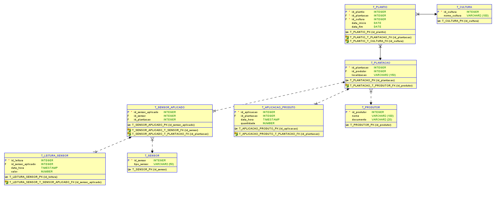

# Capítulo 1 - Um Mapa do Tesouro

Este repositório contém a modelagem de um banco de dados relacional para o desafio proposto pela **FarmTech Solutions** no contexto de Agricultura Digital. O objetivo é criar um sistema de armazenamento e análise de dados coletados por sensores em plantações, otimizando o uso de água e nutrientes.

---

## 📋 Descrição do Projeto

O projeto consiste em modelar um banco de dados que armazene informações coletadas por sensores instalados em plantações. Esses sensores monitoram variáveis como umidade, pH do solo e nutrientes (fósforo e potássio). Com base nesses dados, o sistema sugere ajustes na irrigação e aplicação de nutrientes, além de prever necessidades futuras.

---
## 🗂️ Estrutura do Repositório

- **`README.md`**: Documentação do projeto.
- **`MODELO_IMAGE`**: imagem do DER.
- **`mapa_dmd/`**: Pasta contendo o arquivo do SQL Developer Data Modeler.
- **`scripts/`**: Scripts SQL para criação do banco de dados.

## 🛠️ Estrutura do Projeto

### 1. **Informações Relevantes**
- **Quantidade total de água aplicada por mês**:
  - Dados necessários: `data_hora` e `quantidade_agua`.
- **Variação do pH ao longo do ano**:
  - Dados necessários: `data_hora` e `valor_ph`.

### 2. **Entidades e Atributos (MER)**
As principais entidades e seus atributos são:

- **T_PRODUTOR**:
  - `id_produtor` (PK): Identificador único do produtor.
  - `nome`: Nome do produtor.
  - `documento`: Documento do produtor (CPF/CNPJ).

- **T_PLANTACAO**:
  - `id_plantacao` (PK): Identificador único da plantação.
  - `id_produtor` (FK): Referência ao produtor.
  - `localizacao`: Localização da plantação.

- **T_CULTURA**:
  - `id_cultura` (PK): Identificador único da cultura.
  - `nome_cultura`: Nome da cultura plantada.

- **T_SENSOR**:
  - `id_sensor` (PK): Identificador único do sensor.
  - `tipo_sensor`: Tipo do sensor (umidade, pH, nutrientes).

- **T_SENSOR_APLICADO**:
  - `id_sensor_aplicado` (PK): Identificador único do sensor aplicado.
  - `id_sensor` (FK): Referência ao sensor.
  - `id_plantacao` (FK): Referência à plantação.

- **T_LEITURA_SENSOR**:
  - `id_leitura` (PK): Identificador único da leitura.
  - `id_sensor_aplicado` (FK): Referência ao sensor aplicado.
  - `data_hora`: Data e hora da leitura.
  - `valor`: Valor registrado pelo sensor.

- **T_APLICACAO_PRODUTO**:
  - `id_aplicacao` (PK): Identificador único da aplicação.
  - `id_plantacao` (FK): Referência à plantação.
  - `data_hora`: Data e hora da aplicação.
  - `quantidade`: Quantidade aplicada.

### 3. **Relacionamentos e Cardinalidades**
- Um **produtor** pode ter várias **plantações** (1:N).
- Uma **plantação** pode ter várias **culturas** (1:N).
- Um **sensor** pode ser aplicado em várias **plantações** (1:N).
- Um **sensor aplicado** pode ter várias **leituras** (1:N).

---

## 📊 Diagrama Entidade-Relacionamento (DER)

### IMAGEM DO DER 

---

## 🚀 Como Executar

1. **Abra o arquivo `mapadotesouro.dmd` no SQL Developer Data Modeler**:

2. **Execute os scripts SQL**:
   - Navegue até a pasta `scripts/` e execute os scripts no banco de dados de sua escolha.

---

## 👥 Equipe

- **Flavia Nunes Bocchino**
- **Felipe Silva de Menezes**
- **Pedro Henrique Zani** 